##  简谱

<center></center>

<center></center>

<center></center>

简谱采用如下方式记录音的长短：

<center>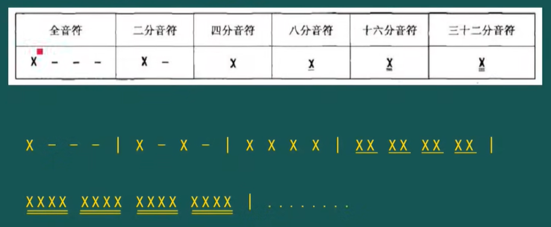</center>

- **-** 显示在X(表示任何一个音)的后面表示**增时线**，比如：全音符 **X - - -**表示X这一个音占4拍
- **-** 显示在X的下面表示**减时线**，比如：八分音符 <b><u>X</u></b> 表示X这一个音占1/2拍

在简谱中，记录音的休止的基本符号是**“0”**。一个单纯的“0”，叫四分休止符；在“0”的下面加一短横，叫八分休止符；加两条短横，叫十六分休止符；加三条短横，叫三十二分休止符；加四条短横，叫六十四分休止符。在“0”的后面再加一个“0”，叫二分休止符；在“0”的后面加三个“0”，叫全休止符。

**有什么样的音符就有什么样的休止符**。现将常用的音符与休止符对照列示如下:

<center></center>


## 打拍子

完整的一拍由“前半拍”和“后半拍组成”，打拍子可以由一下一上来完成。每一拍可以打成一个“V”字：

<center></center>

下图展示了几种不同的节奏打拍子：

<center></center>


## 附点音符和附点休止符

在音符的右下方附加一个黑点叫做单附点音符，加两个黑点，叫复附点音符。

附点音符的作用：增加前面音符时值的一半。

<center></center>

看如下几个实例：

<center></center>

复附点音符第一个附点增加前一个音符时值的一半，后一个点增加前一个附点时值的一半，比如：

```bash
X..   时值为 1+1/2+1/4
```

例如： 1 .. <span style="border-bottom:1px double black;"><u>2</u></span>  (2是一个16分音符)

<center></center>


## 连音符号

<center></center>


## 切分音(切分节奏)

<center></center>

<font color="yellow">*</font> 就是切分音，每一个节奏就是切分节奏(如：<u>6</u> 5 <u>3</u> )。

注意第四个的 **.** 表示5的一个8分音，即 5 .  <=> <u>5</u> <u>5</u> <u>5</u>


## 小节&拍号&强弱

<center></center>

两个小节线之间的部分就是一个小节，一粗一细两条小节线记在乐曲的末尾，表示乐曲的结束。

“拍号”就是表示拍子的记号。拍号用分数形式来标记：分子表示节拍的每一循环，也就是一小节有几拍；分母表示以什么音符为一拍。如：

- 2/4 ：每小节有两拍，以四分音符为一拍；
- 3/8 ：每小节有三拍，以八分音符为一拍。

常见的拍号有：2/4、3/4、4/4、2/8、3/8、6/8等。**在小节线后面的第一拍永远是强拍，前面的一拍永远是弱拍。而一个小节中只能有一个强拍**。单拍子：只有强、弱两种拍子；复拍子：有强、次强、弱三种拍子。

- 1/4只有强拍，没有弱拍，也就是有板无眼（板是强拍，眼是弱拍）。
- 2/4、2/2 第一拍是强拍，第二拍是弱拍。
- 3/4、3/8 第一拍是强拍，第二、三拍是弱拍。
- 4/4、4/8 第一拍是强拍，第三拍是次强拍，第二、四拍是弱拍。
- 6/8 第一拍是强拍，第四拍是次强拍，第二、三、五、六拍是弱拍。

> 在改编的时候，4/4拍改为2/4拍可能会欢快一点。
>
> - 2/4拍的特点是：节奏强弱交替，快速时表现欢快的场面。而慢速时表现坚定有的情绪。
> - 4/4拍的特点是：四二拍的复合而把第二个重拍淡化，从而使歌曲更富有抒情性。

2/4拍案例：

<center></center>

3/4拍案例(强 弱 弱)：

<center></center>

4/4拍案例(强 弱 次强 弱)：

<center></center>

6/8拍案例(强 弱 弱 次强 弱 弱)：

<center></center>

这个案例注意下附点：1/4+1/8+1/4+1/8 = 6/8


## 弱起

**单位拍弱起：**

<center></center>

4/4拍的一个小节是强 弱 次强 弱，而每一个拍子可以分为前半拍、后半拍，**前半拍强，后半拍弱**，上图第一小节中的第一拍是 <u>0 5</u> ，0是休止符，从5开始唱，而5处于当前拍子的后半拍，因此是弱起。

**小节弱起：**

<center>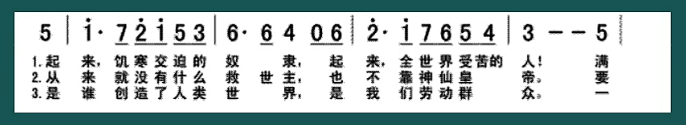</center>

最开始的小节的音在弱拍上，说明这个乐曲是从“弱拍”开始的，所以这样的小节叫做“弱起小节”。弱起小节还可以叫做“**不完全小节”**，因为这个小节的拍子是不完全、不完整的。

弱起小节的两个性质：

1. **弱起小节与乐曲的最后一个小节合并后，是一个完整的小节。**
2. **弱起小节本身不计入小节数，不能算作第1小节。**

**小节弱起且弱拍起：**

<center></center>

<u>0 5</u>是一个弱拍，因此是小节弱起，又5是后半拍，因此是弱拍起。


## 反复记号

<center>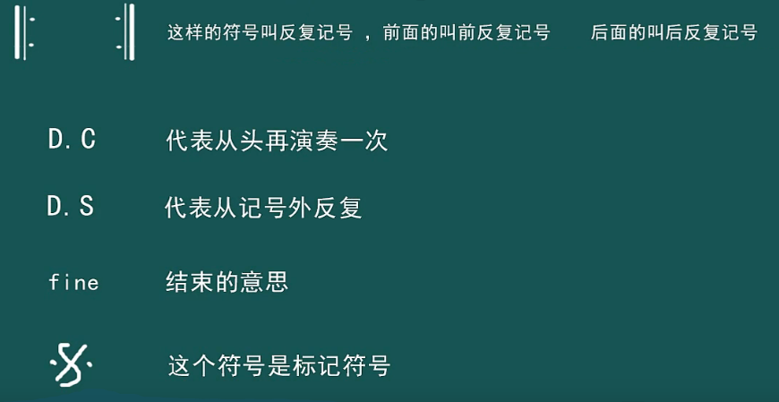</center>

<center></center>


## 倚音(装饰音)

加在一个音的左上角的一个小音符叫单倚音：

<center></center>

加在一个音的左上角的多个小音符叫复倚音： 

<center></center>

## 延长记号

延长记号也叫做自由延长记号，在乐曲中表示演奏或演唱时根据音乐内容需要酌情延长，这个延长没有固定的要求。

延长记号在写的时候，可以写在音符的上方，也可以写在音符的下方，以下两种写法都是正确的：

<center></center>

一般可以延长至原音符的两倍时值，延长时，最少要延长原音符1/2的时值。

> 参考：:point_right: [【乐理】延长记号的写法和用法是什么？](https://zhuanlan.zhihu.com/p/109681110)

## 节奏练习

<center></center>


<center></center>

<center></center>

<center></center>

<center></center>

<center></center>


## 音和音程

### 十二平均律

**十二平均律**：把一组音（八度）分成十二个半音音程的律制，各相邻两律之间的振动数之比完全相等。十二平均律是指将八度的音程（一倍频程）按频率等比例地分成十二等份，每一等份称为一个半音即小二度。一个小二度则是一个半音；一个大二度则是两等份小二度，叫一个全音。两个音在十二平均律上的距离叫做**音数**(音程会讲到)，度量单位为：全音、半音。

钢琴即是根据十二平均律来定音的。其中白键和黑键可以完全对应CDEFGAB之间的所有全音和半音。

- 最常用的有：C（全音）、D（全音）、E（全音）、F（半音）、G（全音）、A（全音）、B（半音），对应白键。
- 进一步使用的有：#C（升C、也叫bD、降D，是CD之间夹着的半音）、#D（升D、也叫bE、降E，是DE之间夹着的半音）、#F（升F、也叫bG、降G，是FG之间夹着的半音）、#G（升G、也叫bA、降A，是GA之间夹着的半音）、#A（升A、也叫bB、降B，是AB之间夹着的半音）。对应白健中间的黑键。

F和B都是半音，为什么没有降F（升E）或者没有升B(降C)呢？

这就要结合通过图示的方式来介绍了：

<center></center>

<center></center>

- E到F之间是一个半音的距离，F到G之间是一个全音，即两个半音，所以有升F（降G），而没有降F（升E），因为降F就是E，升E就是F了。
- A到B之间是一个全音的距离，B到C之间是一个半音，所以有降B（升A），而没有升B（降C），因为升B就是C，降C就是B了。

**曲谱和乐器上标的XX调是什么意思？**

首先曲谱上的调式就是在这个曲谱里面相对音1对应到十二平均律的哪个音名。如：

- C大调的第一个音是以do（1）开始，详细一点：C大调音阶就是do re mi fa so la si do
- D大调的第一个音是以re（2）开始，详细一点： D大调音阶就是re mi fa so la si do re。

同理，乐器上标的调式就是相对音1对应到十二平均律的哪个音名。如：

- C调的笛子第一个音是以do（1）开始，详细一点：C调笛子的音阶就是do re mi fa so la si do
- D调的笛子第一个音是以re（2）开始，详细一点： D调笛子的就是re mi fa so la si do re。

> 普遍的12唱名法是：do di re ri mi fa fi sol si la li ti

> - :point_right:  [【课程】趣味乐理第一课（五度相生律）](https://zhuanlan.zhihu.com/p/27028014)
> - :point_right: [【课程】趣味乐理第二课（纯律）](https://zhuanlan.zhihu.com/p/27150865)
> - :point_right: [【课程】趣味乐理第三课（平均律）](https://zhuanlan.zhihu.com/p/27647079)


### 音程

<center></center>

**音程**：描述了两个音的“音高”之间的距离，也就是说，表征了两个音的高低关系。分为：

- 旋律音程：先后发音，从低音到高音叫上行旋律音程，从高音到低音叫下行旋律音程。（低音是根音，高音是冠音）
- 和声音程：同时发音。

根据和声音程在听觉上所产生的印象，音程可分为协和与不协和两类：

- 听起来悦耳、融合的音程,叫做协和音程。协和音程又分为三种：

  ①极完全协和音程，即完全合一的纯一度和几乎完全合一的纯八度；

  ②完全协和音程，即相当融合的纯四度和纯五度；

  ③不完全协合音程，即不十分融合的大小三度和大小六度。

- 听起来不融合的音程，叫不协和音程，即大小二度、大小七度以及所有增减音程，倍增倍减音程。

描述“音程”共有两个维度：度数和音数。

**度数**：指两个音在五线谱上的距离，度量单位为：度。

例如：

- 1-3，之间含有1 2 3，所以就叫三度
- 2-4，之间含有2 3 4，也是三度
- 1-1，相同两个音之间叫一度，或同度

根据度数，可以将音程分为单音程和多音程：

- 单音程：八度以内的音程(包括八度) 。例如：1-5 ，2-7
- 复音程：八度以上的音程。例如：$1-\dot{6}$，$2-\dot{5}$

**音数**：指两个音在十二平均律上的距离，度量单位为：全音、半音。

<center></center>

例如：

- 1-3之间，1-2是全音，2-3是全音，音数为2
- 2-4之间，2-3是全音，3-4是半音，音数为$1\frac{1}{2}$

根据度数和音数，可以分为：

| 分类                                           | 例子                                                         |
| ---------------------------------------------- | ------------------------------------------------------------ |
| 纯一度，音数为0                                | $1-1，2-2，3-3，4-4，5-5，6-6，7-7，\dot{1}-\dot{1}$         |
| 小二度，音数为$\frac{1}{2}$ （包含一个半音）   | $3-4，7-\dot{1}，\dot{3}-\dot{4}$                            |
| 大二度，音数为1                                | $1-2，2-3，4-5，5-6，6-7，\dot{1}-\dot{2}，\dot{2}-\dot{3} $ |
| 小三度，音数为$1 \frac{1}{2}$ （包含一个半音） | $2-4，3-5，6-\dot{1}，\dot{7}-\dot{2}，\dot{2}-\dot{4} $     |
| 大三度，音数为2                                | $1-3,4-6,5-7，\dot{1}-\dot{3} $                              |
| 纯四度，音数为$2\frac{1}{2}$（包含一个半音）   | $1-4，2-5，3-6，5-\dot{1}，6-\dot{2}，7-\dot{3}，\dot{1}-\dot{4}$ |
| 增四度，音数为3                                | $4-7$                                                        |
| 纯五度，音数为$3\frac{1}{2}$（包含一个半音）   | $1-5，2-6,3-7,4-\dot{1}，5-\dot{2}，6-\dot{3} $              |
| 减五度，音数为3   （包含两个半音）             | $7-\dot{4}$                                                  |
| 小六度，音数为4   （包含两个半音）             | $3-\dot{1}，6-\dot{4}，7-\dot{5}$                            |
| 大六度，音数为$4\frac{1}{2}$（包含一个半音）   | $1-6，2-7，4-\dot{2}，5-\dot{3} $                            |
| 小七度，音数为5   （包含两个半音）             | $2-\dot{1}，3-\dot{2}，5-\dot{4}，6-\dot{5}，7-\dot{6} $     |
| 大七度，音数为$5\frac{1}{2}$（包含一个半音）   | $1-7,4-\dot{3} $                                             |
| 纯八度，音数为6   （包含两个半音）             | $1-\dot{1}，2-\dot{2}，3-\dot{3}，4-\dot{4}，5-\dot{5}，6-\dot{6}，7-\dot{7}$ |

注意名字的划分：

- 大小音程的划分，是根据两个音之间半音的数量，比如一个三度，里面有四个半音，就是大三度，而有三个半音，就是小三度。

- 而纯音程，则是指音响效果达到最高和谐度的音程(即**协和音程**)，大调自然音阶里面有四对，纯一、纯四、纯五、纯八。**纯音程不分大小**，因为它的和谐度已经是最饱满了，在此之上增加或减少半音，都会破坏它的和谐度。但是大小音程则不会，比如大三度减少半音成为小三度，它的和谐度并没有变化，大三和小三的和谐程度是同一等级的。而纯四度如果降低半音，成为大三度的等音程——减四度，它音响效果的和谐度就会明显下降。

  纯一、纯八是极完全协和，纯四、纯五次之，是完全协和，而三度被划分到【不完全协和】的概念中，其实可以理解为，协和到不协和之间的过度。三度所表达的情感就比较人性，不像纯八度那样庄严肃穆。

  协和程度的排序应该是：**【纯】→【大】→【小】→【增】/【减】**

  认为这些音程（和声音程）也可以表达情绪

  【纯】稳定、安宁、庄严、祥和、幸福、等等…

  【大3】喜悦、阳光、等…

  【小3】悲伤、低落、思念、夜晚、阴天、等…

  【小2】阴森、恐怖、害怕、等…

  【增】躁动、外放、不稳定、等

  【减】阴郁、紧张、不安、等


### 转位

**音程的转位：**把音程中某个音向上或向下移动八度，变为一个新的音程。具体有：

1. 把根音向上移动八度，例如大三度变为小六度；
2. 把冠音向下移动八度，例如大三度变为小六度；
3. 同时把根音向上移动八度，冠音向下移动八度，例如大三度变为小十三度。
4. 也可以把某个音移动两个八度。

转位后的名称：

- 如果转位前后都是单音程：新度数=9-原度数；
- 如果转位前是单音程，转位后是一个八度到两个八度的复音程：新度数=16-原度数；
- 更远的复音程以此类推。

转位的性质：**音程转位纯不变，大小增减互相换**。

| 原音程 | 新音程 |
| ------ | ------ |
| 纯     | 纯     |
| 大     | 大     |
| 小     | 小     |
| 增     | 减     |
| 减     | 增     |
| 倍减   | 倍增   |
| 倍增   | 倍减   |


### 变化音

常用的变音记号主要有以下五种：

1. **升记号(#)**：升记号表示将基本音级升高半。如：^#^3、^#^D等；
2. **降记号(♭)**：降记号表示将基本音级降低半音。如: ^♭^5、^♭^E等；
3. **重升记号(x)**：重升记号表示将基本音级升高一个全音。如：^x^4、^x^A等；
4. **重降记号(♭♭)**：重降记号表示将基本音级降低一个全音。如：^♭♭^7、^♭♭^B等；
5. **还原记号(♮)**：还原记号表示将已升高(#或×)或降低(♭或♭♭)的音还源,即恢复成基本音级。如^♮^B、^♮^A等。

比如：

- 1 - ^#^1：增一度
- 1 - ^#^3：增三度
- 3 - ^♭^4：减二度（与3 - 3等音程）
- 1 - ^x^3：倍增三度
- 3 - ^♭♭^4：倍减二度（与3 - ^♭^3等音程，是不存在的）

<center>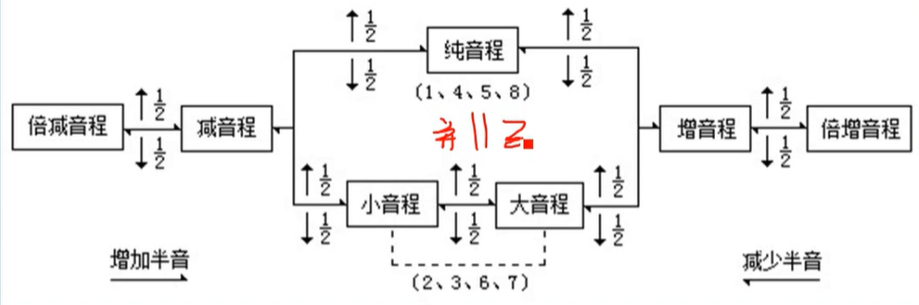</center>


### 等音&等音程

**等音**：音高相同，但是写法、名称、意义不同的音是等音。等音是十二平均律中特有的一个现象，而在五度相生律、纯律中都没有这个现象。

为什么在十二平均律中才有等音现象呢？因为十二平均律产生的半音距离是相等的，所以这些升号音与降号音用了一个频率作为音高。

比如：^#^F和^♭^G就是等音。

而等音除了^#^G和 ^b^A 只有一个等音，其余的各音都有两个等音：

<center></center>


**等音程**：在十二平均律中，音响效果相同，但是写法、意义、名称不同的音程为等音程。(**音响、音数相同，度数不同**)

比如：3 - ^♭^4 与 3 - 3等音程


## 和弦

音乐术语中的和弦其实是三个或三个以上音的结合，并没有规定怎样结合。因此，广义上的和弦并不一定是协和的，也可能是不协和的。而我们大家平时常听到的“和弦”，应该是指**狭义上的和弦**，主要是指三个或三个以上音**按三度关系**的结合，一般是指协和和弦。

### 三和弦

**三和弦**是和弦中的一种，而且是具有基础地位的一种。三和弦是指三个音，按三度关系的结合。

<center></center>

如上图，就是一个三和弦。构成三和弦的每一个音都有它的名称。最下面那个音称为根音（或一音、最低音，标记为1），中间那个是三音（标记为3），最上面那个是五音（标记为5）。

显然地，根音和三音的音程肯定是三度，三音和五音也一定是三度（三和弦的定义规定了这必须成立）。

在音程中，音度分为小三度和大三度，因此，三和弦就可以根据每对相邻音的音程关系，分为四种：

1. **大三和弦**。根音和三音：大三度。三音和五音：小三度。

   例子：C和弦（ 三音分别为 1-3-5）

2. **小三和弦**。根音和三音：小三度。三音和五音：大三度。

   例子：Dm和弦（三音分别为 2-4-6）；Am和弦（三音分别为$6-\dot{1}-\dot{3}$）；

   Em和弦（三音分别为3-5-7）；（右下角的m是小三和弦的标示）

3. **增三和弦**。根音和三音：大三度。三音和五音：大三度。

   例子：C+和弦（或记为Caug，三音分别为 1-3-#5）(**Augmented chord增三和弦**)

4. **减三和弦**。根音和三音：小三度。三音和五音：小三度。

   例子：D°和弦（或记为Ddim，三音分别为 d-f-#g）(**Diminished triad减三和弦**)

其中，大、小三和弦是协和和弦；增、减三和弦是不协和和弦。大、小三和弦是非常常用的，尤其是在对流行歌曲的民谣吉他伴奏中。

上述所描述的三和弦都是根音在最下面的，称为**原位三和弦**。如果根音不在最下面，而跑到其他地方去了，那么称为**转位三和弦**。

以吉他为例，Ｃ大调的和弦按音名排列分别是C、Dm、Em、F、G、Am、Bdim（也叫做调内和弦）：

<center>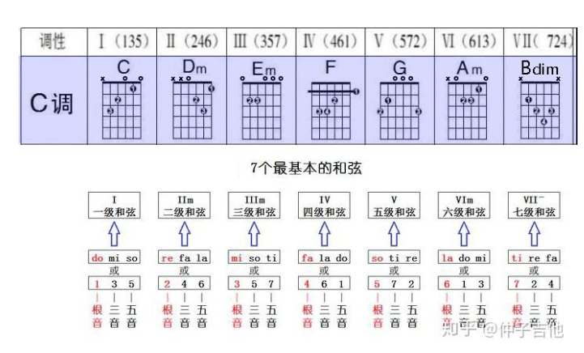</center>

和弦图上ｘ表示和弦外音，弹这个和弦时不能碰到这根弦。ｏ表示空弦音，属于和弦里面的音。１２３４分别表示左手的食指、中指、无名指、小指，上图F和弦表示食指横按第一品。

在调式中1级音（就是第1个音）叫做**主音**，4级音叫做**下属音，**5级音叫做**属音**(属音，就是主音的上方纯五度；下属音，主音下方纯五度，大调里是4)，。由这些音作为根音构成的**自然三和弦**分别叫做**主和弦**、**下属和弦**、**属和弦**，都是大三和弦。那由这些音作为根音构成的**自然七和弦**分别**主七和弦**、**下属七和弦**、**属七和弦**。

属和弦或属七和弦如果随后接的是主和弦，就构成和弦的解决。和弦的解决给人以由骚动不安到平和宁静的完美感，是构成音乐美的重要元素。可惜，在确定了调式的音乐里，只有一个这样的属大三或属七和弦，一个主和弦。

而属音之外的音也可以构成大三和弦和大三小七和弦(属七和弦)，此时称为**副属和弦**，也叫临时属和弦，比如：C大调里以II级音为根音构成的大三小七和弦D#FAC，这时V和弦称为**临时主和弦**。

副属和弦的解决中最常见的是II-V的解决。II级音上的大三和弦又称**重(chong)属和弦**，因为这个和弦是属和弦V的临时属和弦。

> 副属和弦的使用可以参考配和弦部分！


### 七和弦

**七和弦**：由四个音按三度叠加构成，根音与最高音之间成七度音程。

<center></center>

**七和弦的分类**：在C大调顺阶和弦当中，所有的三和弦都可以变化成七和弦

<center></center>

这些七和弦可分为四类：

- 大七和弦（Ⅰ级、Ⅳ级）(maj就是大和弦)
- 属七和弦（Ⅴ级）
- 小七和弦（Ⅱ级、Ⅲ级、Ⅵ级）
- 半减七和弦（Ⅶ级）

但是七和弦家族的成员可远远不止这些，七和弦可以分为**8类**

<center></center>

大七：1 3 5 7		属七：1 3 5 b7		小大七：1 b3 5 7		小七：1 b3 5 b7

半减七：1 b3 b5 b7		减七：1 b3 b5 bb7		增大七：1 3 #5 7		增七：1 3 #5 b7

七和弦的推导：

<center></center>


七和弦的特色：

以Cmaj7（CEGB）和弦为例，把这个和弦的组成音拆解开，可以发现：

C、E、G三个音组成了一个C和弦；

E、G、B三个音又组成了一个Em和弦；

所以，Cmaj7和弦也可以看成两个三和弦的叠加，既有大三和弦的色彩，又有小三和弦的色彩，所以才导致这种和弦听起来非常的迷人。

G7（GBDF）这个和弦同样把它拆分开，可以看到：

G、B、D组成了一个G和弦；

B、D、F这三个音，因为B到F是增四/减五度音程，所以这三个音组成了B-和弦；

因为增四/减五音程**极其不稳定**，有着强烈的**回归主级**的感觉，所以**属七和弦回归主级的感觉要比其他任何的和弦都要强烈！**

> :point_right: [这一次，我们彻底搞懂七和弦！](https://zhuanlan.zhihu.com/p/68897347)


### 和弦的转位

三和弦的转位，以C和弦(C E G)为例：

- 根音C翻高一个八度，和弦变成了$E\ G\  \dot{C}$，称为C和弦的第一转位，记为C/E；（此时根音仍是C，三音还是E，五音还是G）
- 把E再翻高一个八度，和弦变成$G\ \dot{C}\  \dot{E}$，则称为C和弦的第二转位，记为C/G；
- 最后，再把G翻个八度，和弦再次变回了C E G，即我们正常的三和弦，也叫原位和弦。

七和弦的转位，以G7和弦($G B \dot{D} \dot{F} $)为例：

- 根音G翻高一个八度，和弦变成了$B \dot{D} \dot{F}\dot{G}$ ,称为G7和弦的第一转位，记为大小五六和弦；（五：低音到七音的度数，六：低音到根音的度数）
- B翻高一个八度，和弦变成了$\dot{D} \dot{F} \dot{G} \dot{B} $称为G7和弦的第二转位，记为大小三四和弦；
- D翻高一个八度，和弦变成了$\dot{F} \dot{G} \dot{B} \dot{\dot{D}}$称为G7和弦的第三转位，记为大小二和弦；


### 九和弦

九和弦：有**五个音**根据三度音程关系叠加组成， 在三和弦的上方再叠加两个三度音，这个**和弦的冠音与根音距离为9度**故称九和弦。

九和弦一共有五个音，分别是根音、三音、五音、七音和九音。**所有的七和弦都可以使用九音作为扩展音。**标记还是以C为例。

| 名称         | 构成                    | 标记                  |
| ------------ | ----------------------- | --------------------- |
| 大九         | 大七+九度  1 3 5 7 9    | Cmaj9、CM9、CΔ9       |
| 属九         | 属七+九度 1 3 5 b7 9    | Cdom9、C9             |
| 小九         | 小七+九度 1 b3 5 b7 9   | Cmin9、Cm9、C-9       |
| 增九         | 增七+九度 1 3 #5 b7 9   | Caug9、C+9            |
| 减九和弦     | 减七+九度 1 b3 b5 bb7 9 | Cdim9、Cº9            |
| 属九挂四和弦 | 1、4、5、b7、9          | Cdom9(sus4)、C9(sus4) |
| 六九和弦     | 1、3、5、6、9           | C69                   |
| 小六九和弦   | 1、b3、5、6、9          | Cm69、C-69            |

当谱例中出现九和弦时，可以理解为七和弦加入了大九扩展音，那么其它的可用扩展音还是可以继续叠加的，注意因为使用了9音，属七等就不能使用b9或者#9了。

除减九和弦仍可用大七扩展音外，九和弦可用扩展音只有十一音、十三音。

<center></center>

**不做升降标记情况下，9音为大9度，11音为纯11度（纯4度），13音为大13度。**加小九度标记为b9，加增九度标记为#9

Em的属七降九和弦为E7b9：3 #5 7 2 4。Am的属七降九和弦A7b9：6 #1 3 5 b7

### 和弦推导

拿到一个三和弦的内音，我们要迅速反应出七和弦、九和弦、十一和弦、十三和弦。

1. **隔音跳读三度音**。每两个音之间是一个三度。

   <center></center>

2. **"9"度法**。根据音程的转位，若为单音程，则新度数=9-原度数。

   <center></center>

3. **四度圈法**。7362514（BEADGCF）

   <center></center>

例子：

根据方法二，可以快速知道：

<center></center>

根据方法三，可以快速知道：

<center>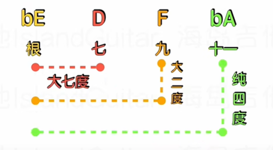</center>

根据方法二，可以快速知道： 

<center></center>

## 调

### 调式

调式：几个音按照一定的关系联结在一起，并以某个音为中心的体系。调式所具有的特性称为调性。

调式中最稳定的音称为**主音**。

调式中的音可以分为稳定音和不稳定音。稳定音给人以支柱感。不稳定音则具有进入稳定音的特性，称为“倾向”。不稳定音根据其倾向进入稳定音的过程称为“解决”。

从主音到另一个高八度的主音，从低到高依次排列，称为音阶。

常见的调式有：“大调”，“小调”。

<center></center>

**大调公式：全全半全全全半**

C大调：1 2 3 4 5 6 7 $\dot{1}$

G大调：5 6 7 $\dot{1}$ $\dot{2}$ $\dot{3}$ $ \# \dot{4}$ $\dot{5}$

**小调公式：全半全全半全全**

a小调：6 7 $\dot{1}$ $\dot{2}$ $\dot{3}$ $\dot{4}$ $\dot{5}$ $\dot{6}$

e小调：3 #4 5 6 7 $\dot{1}$ $\dot{2}$ $\dot{3} $

c小调：C D bE F G bA bB $\dot{C} $

在实际使用中，上面讨论的升降号都会用调号的形式表示出来，所以乐曲中是没有临时升降号的，这样的调叫做**自然大调**或**自然小调**，然而还有其他的一些调要用临时升降号变化而来： 

**和声小调**：用临时升降号升高自然小调中第7级音得到的小调，例如a和声小调（上图）

**旋律小调**：上行时用临时升降号升高自然小调的第6级和第7级音，下行是还原第7级和第6级音得到的小调，例如a旋律小调（上图）

在听觉上，小调的感觉为阴暗，悲伤；大调为明亮，平和。


### 五度循环圈

**五度循环圈**又叫**调性循环圈**，它非常像我们平时用的钟，钟面有12个大刻度，分别代表每一个小时，在五度循环圈中我们就要用到这12个位置。

接下来看一看所有大调的调名和调号：

<center>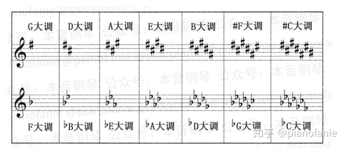</center>

为什么没有**C大调**呢？因为C大调没有调号！

<center></center>

- C大调放在12点；
- 顺时针开始，1点钟放1个升号的G大调，2点钟放2个升号的D大调，以此类推，一直到7点；
- 逆时针开始，11点放1个降号的F大调，10点放2个降号的bB大调，以此类推，一直到5点；
- 最后只要把逆时针和顺时针的圈重叠在一起，就得到**大调**的五度循环圈了。

为什么它叫“五度循环圈”呢？

1. 按**顺时针**方向每走1个小时，音就比前面**高**纯五度；

2. 按**逆时针**方向每走1个小时，音就比前面**低**纯五度。

5点、6点、7点位置是有两个音名的，而且这两个音名在键盘上弹出来是同一个键，B=bC，#F=bG，#C=bD，这解释了为什么理论上有**15个**大调（1个C大调，7个升号调，7个降号调），而实际上只有**12个**大调，因为有3个调是重复的。

如果理解了大调，那小调就简单了，这是所有小调的调名和调号：

<center></center>

为什么没有a小调呢？因为a小调没有调号！

<center></center>

- a小调放在12点；
- 顺时针开始，1点钟放1个升号的e小调，2点钟放2个升号的b小调，以此类推，一直到7点；
- 逆时针开始，11点放1个降号的d小调，10点放2个降号的g小调，以此类推，一直到5点；
- 最后只要把逆时针和顺时针的圈重叠在一起，就得到**小调**的五度循环圈了。

相同：

1. 按**顺时针**方向每走1个小时，音就比前面**高**纯五度；
2. 按**逆时针**方向每走1个小时，音就比前面**低**纯五度。

5点、6点、7点位置是有两个音名的，而且这两个音名在键盘上弹出来其实是一个键，这解释了为什么理论上有**15个**小调（1个a小调，7个升号调，7个降号调），而实际上只有**12个**小调，因为有3个调是重复的。

既然大调和小调都可以构成五度循环圈，把两个循环圈重合在一起：

<center></center>

就得到**双环五度循环圈**了。

1. 在同一个时钟点上的大小调互为“**关系大小调**”，也叫“**平行大小调**”，比如C大调和a小调都在12点；
2. 时差越近的调，关系也越近，叫做“**近关系调**”，比如C大调和G大调，时差1小时，关系最近；
3. 时差越远的调，关系也越远，叫做“**远关系调**”，比如C大调和#F大调，时差6小时，关系最远。


### 调名&调号

<center></center>

调号中带有升号（#）的调都叫做“升号调”。以E大调为例，调号读作#F、#C、#G、#D。

1. **升号调中后一个要升的音比前一个要升的音高五度**；
2. **升号调中最后一个要升的音，再升高半音，就是调名**。

再以#C大调为例，调号读作#F、#C、#G、#D、#A、#E、#B，再升高半音，就是#C，所以叫#C大调。

同理：

<center></center>

调号中带有降号（b）的调都叫做“降号调”。

1. **降号调中后一个要降的音比前一个要降的音低五度**；
2. **降号调中，除F大调外，倒数第二个要降的音，就是调名**。

以^b^G大调为例，调号读作bB、bE、bA、bD、bG、bC，倒数第二个要降的音就是bG，所以叫“降G大调”。


小调和大调的调号有对应关系，在循环圈里，内外环相对应的为关系大小调，它们使用相同的调号。**当知道大调叫什么后，只需要向下找小三度即可得到小调的名称。**

比如：bB大调也就是g小调


### 音阶

音阶：从主音到另一个高八度的主音，从低到高依次排列。就是以全音、半音以及其他音程顺次排列的一串音。可以简单的理解为多个音符按照某种音程关系从低到高、从高到低排列，就是音阶。

在音乐里面C D E F G A B C就是音阶，顺序是不固定的，可以其他方式排列(根据不同的调)，其中也会包括#（升）号和♭（降）号。


### 音阶图（吉他）

下图以C调为例

<center></center>

1. 吉他的空弦音都为EADGBE(362573)；

2. 在吉他上，六弦和一弦的音是完全相同的，只是低了两个八度，低音3，高音3；

3. 空弦音和12品的音也是完全相同的，12品高了一个八度；

4. 吉他六弦到五弦，五弦到四弦，四弦到三弦，二弦到一弦都是纯四度的关系，那我们就可以得出，相邻的两根弦同一个品上，它的音是纯四度，1下面肯定是4，2下面是5…

   另外一个规律，因为34和71都是半音关系，所以71下面肯定是34，当然二三弦除外

5. 只有三弦和二弦是大三度关系，71下面的34要向右移一品，两根弦因为是三大度的关系，所以1下面肯定是3，4下面是6…都是大三度关系。可以理解为三弦和二弦右移的一位是纯四度关系。

分为五种指型，把自然音级中C、D、E、F、G、A、B中的BC和EF中的两个半音C和F去掉后，用剩下的D（re）、E（mi）、G（sol）、A（la）、B（si）这五个音形成的。因为C和F的音阶排列中，很多是和其他相关指型是重复的，所以就去掉了。比如上图里C调中的si指型，在6弦上有三个音，第一个音是食指按在6弦7品上，该品的音是低音si（7）,所以这一把音阶排列就叫做si指型。

<center></center>

五种指型的名称是mi（3）、la（6）、re（2）、sol（5）、si（7），那么每根弦开始的第一个音也是这些。从6弦到1弦的音名显示顺序是mi（低音3）、la（低音6）、re（中音2）、sol（中音5）、si（中音7）、mi（高音3）


> :point_right: 音阶图网站：[吉他常用音阶模式图 - 吉他社 (jitashe.org)](https://www.jitashe.org/tool/yinjie/)


### 转调后和弦转换

<center></center>

注意：变调夹只能升调，而**不能降调**，如C转D，可将变调夹夹二品，而仍用C调指法弹奏。如果是降调，则需要进行和弦的转换了。


### 练习

- 音阶练习：https://www.bilibili.com/video/BV1iR4y1J7DF/?vd_source=364084ab59b14d9683abca32b2193ea6

- 音程构唱：音程的构唱分为度数构唱和音高构唱，度数构唱就是比如说我给你一个mi，让你唱上方的XX度，比如纯四度，mi上方的纯四度是la，那你就得把la唱准；音高构唱比如说给一个音do，让你唱上方的fa，那你就得把fa唱准就可以了。

  https://www.bilibili.com/video/BV1jW411J765?p=33&vd_source=364084ab59b14d9683abca32b2193ea6

  [我是如何练习音程的？](https://www.bilibili.com/video/BV1q34y177Ue?spm_id_from=333.337.search-card.all.click&vd_source=364084ab59b14d9683abca32b2193ea6)

  [【听音梯度训练】10个级别从小白到大神，听准单音到和声音程，反复练习轻松掌握！](https://www.bilibili.com/video/BV1fU4y1F7g8?spm_id_from=333.337.search-card.all.click&vd_source=364084ab59b14d9683abca32b2193ea6)

  [音感音准练习-音程-音阶-钢琴/吉他/弦乐](https://www.bilibili.com/video/BV1Ny4y1i7cN?spm_id_from=333.337.search-card.all.click&vd_source=364084ab59b14d9683abca32b2193ea6)


<center></center>

<center></center>

<center></center>

<center></center>

<center></center>

<center></center>


## 配和弦

### 步骤

<center></center>

1. 拿到一个歌曲后考虑**和弦所在位置**是需要，每一个小节配一个和弦还是每两拍配一个和弦。

   这是一首抒情歌曲，那么在主歌部分我们就不要把和弦编配的太密集，我们就选择**一个小节来配一个和弦**，让伴奏听起来比较抒情，情感表更舒缓。

2. 配主和弦，根据歌曲的曲调，如果是大调，开头、结尾都配上C和弦；如果是小调，开头、结尾都配上Am和弦。

3. 配和弦，尽可能的包含最多的音，以重音为主，选择旋律音作为和弦三音的和弦，其次再考虑旋律音作为和弦根音或五音的和弦。（三音从根本上能决定和声色彩）

   第二小节：第一个旋律音是7，可以配G（5 7 2）或者Em（3 5 7），这个小节里面其他的旋律音是Em组成音，所以配Em更合适。

   第三小节：第一个旋律音是6，可以配F（4 6 1）或者Dm（2 4 6），小节其他旋律音和F一样的最多，所以配F。

4. 相邻和弦尽量不要一样，旋律相近我的可以采用相似和弦代替；考虑经典和声套路；前面相似的和弦组直接重复使用；考虑逆357度。

5. 美化和声。

   一个和声套路：4536251：

   <center></center>

   方法一：**插入调内和弦的转位和弦**。如图这种方法，就是在4/5 和3m7直接插入5/4和弦，使低音做一个5-4-3的下行级进。(<u>4/5和弦</u>：F大三和弦 根音用五级G 效果近似于G11和弦)

   <center></center>

   方法二：**小三和弦属化**。小三和弦有Dm Em Am，在编配和弦时，这三个和弦就可以用属和弦D7 E7 A7。

   - **当我们用Dm（2,4,6）配和弦时，如果旋律音没有4，那么就可以用D7（2 #4 6 1）**
   - **当我们用Em（3 5 7）配和弦时，如果旋律音没有5，那么就可以用E7（3 #5 7 2）**
   - **当我们用Am（6 1 3）配和弦时，如果旋律音没有1，那么就可以用A7（6 #1 3 5）**

   <center></center>

   图中将3级和弦3m变成了3/#5，这是将三级和弦替换成3级的属七和弦的转位，从而使低音有一个5-#5-6的半音级进，使低音连接更加顺畅，同时有一个离调的效果。

   - **6级和弦改成了六级的属七降九和弦**。属七和弦加上一个九度音的降半音就是属七降九。A7b9就是6 #1 3 5 b7

     <center></center>
   
   方法三：**插入副属和弦**。除1，7级外，以当前三和弦为临时主和弦，其上方纯五度或下方纯四度的和弦为副属和弦。
   
   <center></center>
   
   在这里我们将3级和6级和弦中加入了6级的副属和弦，例如：**在C调中，六级Am的副属和弦是E7和弦，我们就可以在六级前加入E7和弦，可以有属七到主很有解决感的一个听觉效果。**
   
   <center></center>
   
   也可以在**二级前加入二级的副属和弦**，例如在C调中，二级Dm和弦的副属和弦是A7，我们可以加入A7的第一转位进行演奏。
   
   <center></center>
   
   方法四：**降二代替**。一个和弦中，最可以表现和弦性质的音是三音和七音，在大七和弦，小七和弦，属七和弦中，我们利用三音和七音就可以将和弦区分出来。其中**属七和弦三音和七音的关系，我们称之为“三全音”**。G7和弦(G B D F)的三音为B，七音为F，由于三全音的转位还是三全音，所以，**一个三全音属于两个属七和弦，那么这两个属七和弦就可以相互替代，也就是“三全音替代”**。而G7可以被Db7(降二级和弦，D F A bC)代替。
   
   <center></center>
   
   首先我们将六级和弦Am（在C调情况下），换成副属和弦A7，然后再以A7为属和弦，利用降二级和弦替换A7和弦，即Eb7和弦替换A7和弦。其中共同音为#1 和 5。
   
   
   
   方法五：**调式互换**。就是指不同调式的顺阶和弦互相借用。其中最为常用的就是平行大小调之间借用和弦。比如：C调卡农和弦最后是Dm7-G7，我们可以借用c小调的2级来替代大调的2级，所以就变成了Dm7b5-G7(Dm7b5：D F Ab C，5音降半音)。
   
   <center></center>
   
   **在C大调中，四级常常可以借用C小调和弦中的4m（4m7）。**在演奏时我们经常弹奏4m6和弦（小六和弦 4 6b 1 2）或4mM7（小大七和弦 4 6b 1 2 3） 当旋律出现6b（调外音）或1 2 3的时候，我们借用四级的小和弦替换四级的调内和弦。在这里，我们利用小调中的4m6替换了4/5和弦。

> :point_right: [如何给一首歌配和弦？](https://zhuanlan.zhihu.com/p/62101138)


### 1625配和弦

<center></center>

完整谱子：[《存在》吉他谱-汪峰-C调弹唱吉他谱-吉他派 (jitapai.com)](https://www.jitapai.com/20206776.html)


### 1645配和弦

<center></center>


### 15634145配和弦

<center></center>


## 五线谱简谱互译

<center></center>

 五线谱是A调，简谱是转为了C调


## 五线谱

### 线和间

<center></center>

每一条线和每一个间都代表着一个音的高度。 然而这五条“线”和四个“间”还不够表达我们的情感心声，如果还有更高的音或者更低的音出现怎么办呢？于是就产生了更多的“线”和“间”。

<center></center>

这些临时多出来的“线”和“间”叫做“上加线”和“下加线”。上面多出来的线叫做“上加线”，上面多出来的“间”叫做“上加间”。下面多出来的“线”和“间”叫做“下加线”和“下加间”。这些“线”和“间”向上下两边呈放射形。“上加线”和“上加间”是自下而上，往上数的，分别叫做“上加一间”、“上加一线”、“上加二间”、“上加二线”、“上加三间”、“上加三线”……以此类推。

高音谱号的下加一线等于低音谱号的上加一线，下加二线等于低音谱号的五线。


### 谱号

**谱号** 在五线谱上确定音高的位置---也就是音名位置的符号叫做谱号。

谱例1： 高音谱号（G谱号）

<center></center>

谱例2： 低音谱号（F谱号）

<center>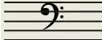</center>

谱例3： C谱号

<center></center>

<center></center>

**C谱号** C谱号基本上是由上下两个英文字母“C”反过来，再加上两个竖线，（一根粗、一根细）组成。

这个谱号的特点是：两个反过来的字母“C”最中间对准哪条线，哪条线就是“C”音（DO）。也叫做那条线的谱号，比如对四线，就叫“第四线C谱号”（也有人叫它次中音谱号），对准第三线就叫“第三线C谱号”（也有人叫它“中音谱号”）。


### 休止符

<center></center>


### 音名

音名主要有七个基本音，就是C D E F G A B，其他几种表示：

（汉语译音）多 瑞 咪 发 索 拉 希

（汉语拼音）Do Ruai Mi Fa Sol La Xi

（ 简谱 ） 1 2 3 4 5 6 7

在乐音的“家族”中有几十个高低不同的音，但是最基本只有这七个音，其它高、低音的音名都是在这个基础上变化出来的。

<center></center>

乐音的大家族里有几十个高低不同的音，但是它们并不混乱，而是井然有序的，人们都分别给他们排了队、分了组。这样我们就不难辨认他们了。它们分组的原则是以实际音高来区分的。

“中央C”是主角，为什么叫它中央C呢？因为它是钢琴上距离钥匙孔最近的一个音。中央C的唱名也叫（DO）。

从这个音一直到往右弹到B（Xi），这是一组。这一组叫做“小字一组”。再往右，也是从C（DO）开始再到B（Xi）这又是一组。这一组叫“小字二组”。总之是七个音一组，依次往右排，分别叫“小字三组”、“小字四组”、“小字五组”等。

从中央C（DO）左边的一组音（也是7个音）叫做“小字组”，然后，再往左，同样是7个音一组，依次叫做“大字组”、“大字一组”……。


### 音符

每个音的音符们也各有不同。但是它们大部分基本上都是由三个部分组成的 。即“符头”、 “符干”、 “符尾”。谱例1：

<center></center>

前面我们已经知道这些音符的名字了，现在让我们看一看在五线谱中，这些音符各自的位置在哪里。谱例2：

<center></center>

不同的音符代表不同的长度。音符有以下几种： 全音符、二分音符、四分音符、八分音符、十六分音符、三十二分音符、六十四分音符。谱例3：

<center></center>

高音符号：

<center></center>

低音符号：

<center></center>

注意低音符号的C3就等于高音符号的C3。


### 变化音

<center></center>

在一个音前写#代表升一个半音，写b代表降一个半音，并且如果后面有一个相同的变化音就不用再打符号了，但如果想还原成原来的音，就可以打一个还原符号(如上图)。


### 踏板标记

<center></center>

左边符号是踩踏板，右边符号是松踏板。


### 重音记号、渐强记号、渐弱记号

重音记号，钢琴弹奏时使用更大的力度 , 人声演唱时使用重音演唱 ：

<center></center>

渐强记号，使用钢琴演奏时 , 该渐强符号范围的音符演奏力度越来越强 ：

<center></center>

减弱记号，使用钢琴演奏时 , 该渐弱符号范围的音符演奏力度越来越弱 ：

<center>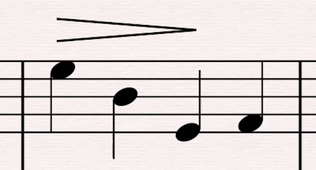</center>


### 琶音

琶音记号就是写在柱式和弦左边的竖波浪记号：

<center></center>

弹奏的时候，必须由下至上先后把这几个音弹出，并且按住不放，保持后面的时值，奏法如下：

<center></center>


### 和弦


## 和弦按法（吉他）

### 三和弦

<center></center>

<center></center>

<center></center>

一共两种口诀：13513、15135，指的是从六弦往下和每弦的度数。C和弦和G和弦按的都是13513，A和弦E和弦D和弦按的是15135（D和弦没有最后的5）

<center></center>

>以根音为准往左边按的指法就是13513排列，比如C形状和G形状的和弦指法。但是以根音为准往右边按的指法就是15135排列，如A,E,D三个形状的和弦指法。

如果此时是Csus4和弦，只需要将3提高一个半音：

<center></center>

​     


### 自然大调音阶指型

以C大调为例：

<center></center>

向右移动：

<center></center>

向上移动就是G大调，其实就是每个音降纯四度： 

<center></center>

向下移动一格，因为二弦和三弦之间是大三度，因此要向右移动一个半音： 

<center></center>

向下移动两格： 

<center></center>

以C开始弹：

<center></center>


### 五大音阶指型    

<center></center>

<center></center>

<center></center>

<center></center>

注意，因为二弦和三弦是大三 度关系，因此二弦和一弦对应的要往右移动一个半音。


### CAGED系统

CAGED系统包含两种意思：

- 和弦指型：CAGED五种和弦，以及一个和弦有五种按法；

  <center></center>

  <center></center>

- 音阶指型：有五个不同音阶指型不同把位的同一个音阶，每个把位音阶都有同一个和弦内音。

  <center></center>

<center>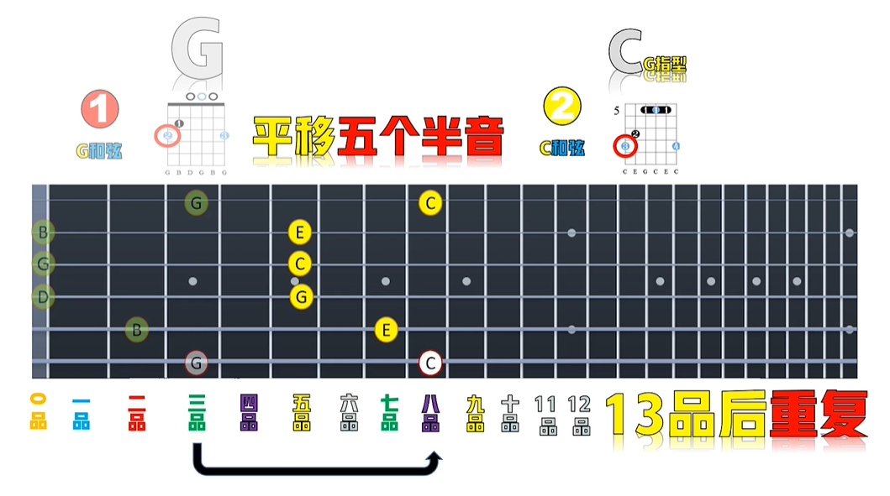</center>

<center>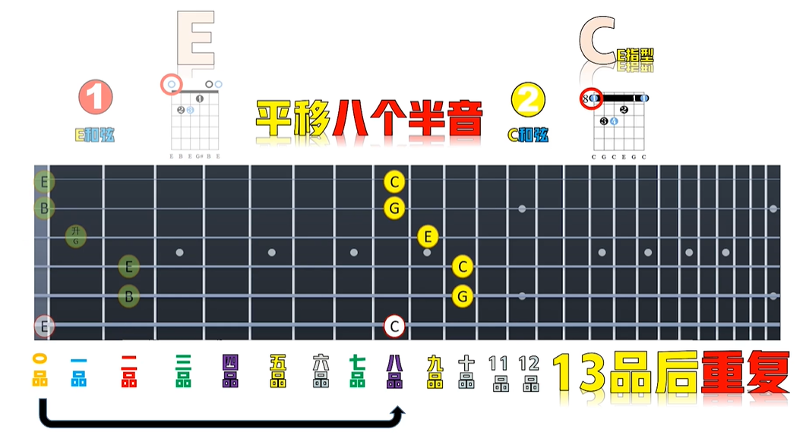</center>

<center></center>

**其实就是利用食指做变调夹！！！**

看下常用的：

<center></center>

<center></center>

<center></center>

<center></center>

<center></center>

<center></center>

<center>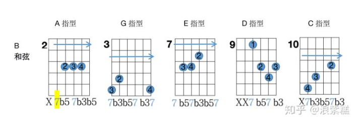</center>

<center></center>

<center></center>

<center></center>

<center>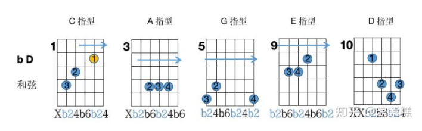</center>

<center></center>


> 参考：:point_right: [吉他CADEG系统五度圈大三和弦把位图](https://zhuanlan.zhihu.com/p/212804498)


### 构建三和弦

<center></center>

每一个指法依次对应原位，第一转位，第二转位。

除了一阶和弦，还有234、345、456弦：

<center></center>

<center></center>

<center></center>


 


## 参考​

-  :point_right: [乐理视频](https://www.bilibili.com/video/BV1jW411J765?p=1&vd_source=364084ab59b14d9683abca32b2193ea6)

-  :point_right: [**海岛吉他IslandGuitar**](https://space.bilibili.com/646651251/video?tid=0&page=2&keyword=&order=pubdate)

- :point_right: [pianofanie的音乐&钢琴专栏（目录）](https://zhuanlan.zhihu.com/p/24352453)   

- :point_right:[​ 如何自学视唱练耳，有哪些循序渐进的方法？](https://www.zhihu.com/question/20883488)

- :point_right: [如何给一首歌配和弦？](https://zhuanlan.zhihu.com/p/62101138)

- :point_right: [【业余向】和弦进行的个性化](https://zhuanlan.zhihu.com/p/393693502#:~:text=调式互换，简单来说，就是把其他调的和弦借过来用。,例如C大调中借用 同主音小调（c小调）的和弦，C调卡农和弦最后是Dm7-G7，我们可以借用c小调的2级来替代大调的2级，所以就变成了Dm7b5-G7。)

- :point_right: [乐理干货：史上最全的五线谱基础教程！](https://zhuanlan.zhihu.com/p/31864712)

- :point_right: [【吉他干货】吉他C大调音阶图 ](https://zhuanlan.zhihu.com/p/496745355)

- :point_right: [如何记住吉他指板每个位置代表的音符？](https://www.zhihu.com/question/350769241)

  


 